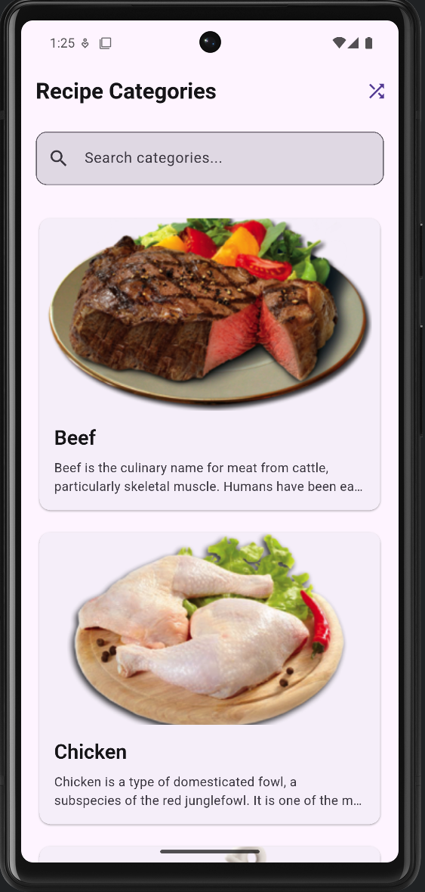
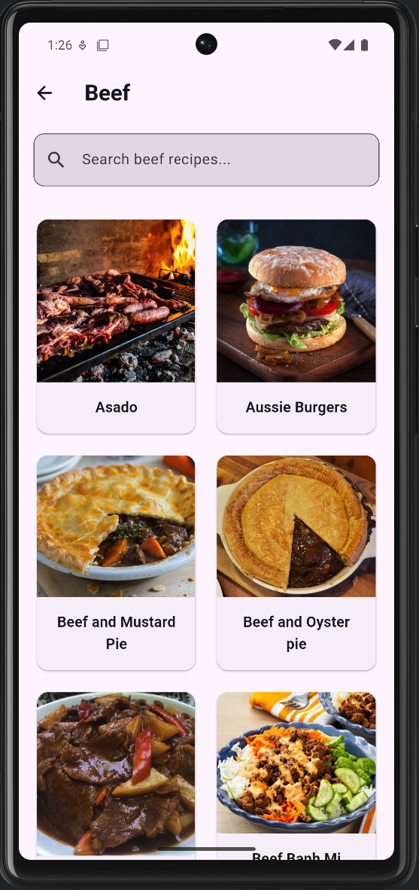
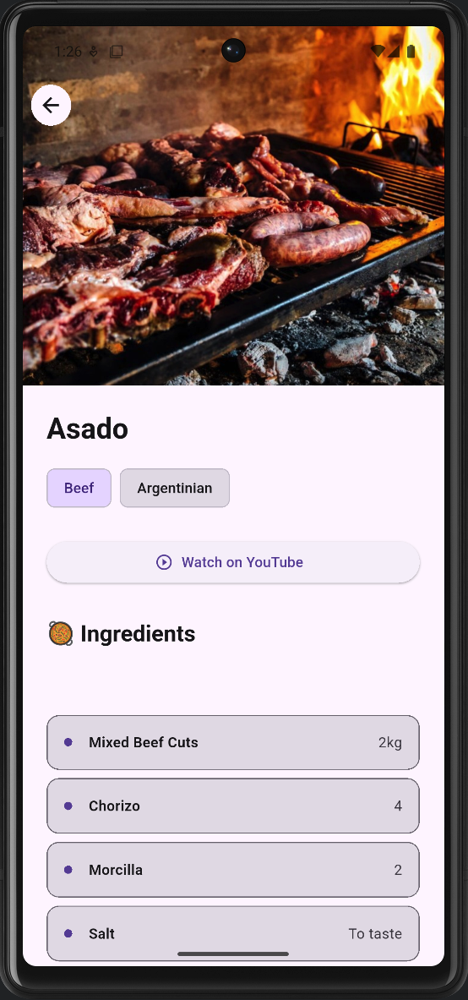
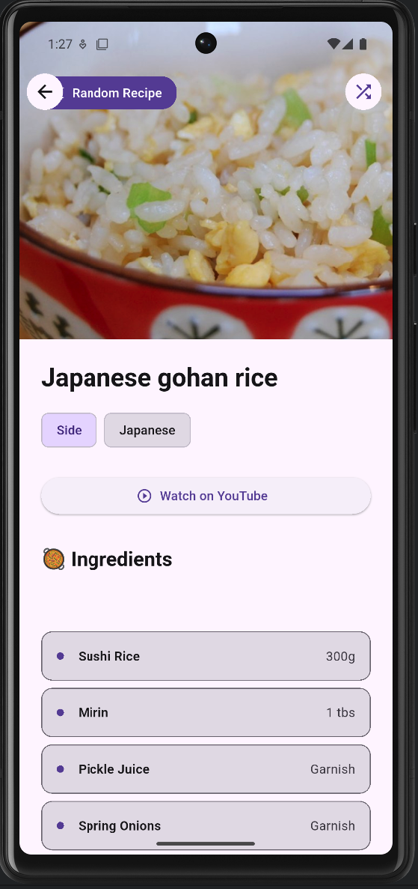
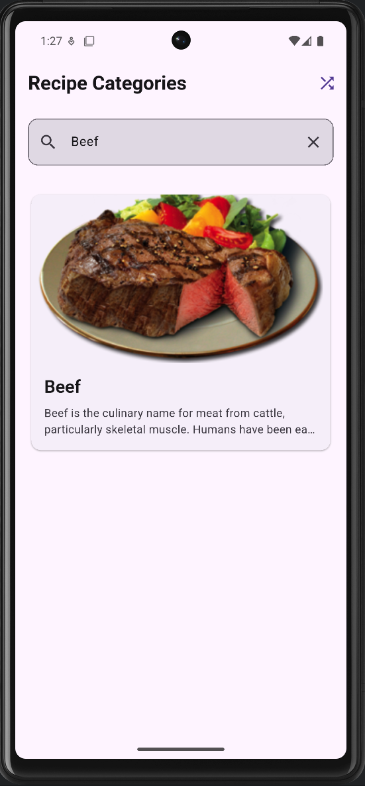
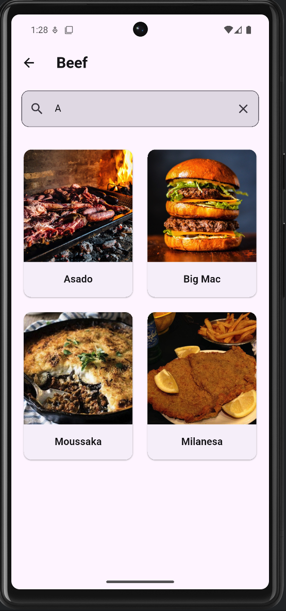

# Exam Schedule (Lab 1)

## Screenshots

	

	

	

	

	

	

Лабораториска вежба 2

Да се имплементира апликација за прикажување на рецепти со користење на API од TheMealDB (https://www.themealdb.com/api.php).
Барања:

    Почетен екран - Листа од категории
        Прикажете листа на картички со сите категории на јадења
        Endpoint: https://www.themealdb.com/api/json/v1/1/categories.php
        Секоја картичка треба да содржи: име на категорија, слика и краток опис
        Овозможете пребарување на категории
    Екран со јадења по категорија
        При клик на некоја категорија, да се прикаже нов екран со сите јадења од таа категорија
        Endpoint: https://www.themealdb.com/api/json/v1/1/filter.php?c={category}
        Прикажете ги јадењата во grid layout со слика и име
        Овозможете пребарување на јадења од избраната категорија (https://www.themealdb.com/api/json/v1/1/search.php?s={query} )
    Детален приказ на рецепт
        При клик на јадење, отворете екран со детален рецепт
        Endpoint: https://www.themealdb.com/api/json/v1/1/lookup.php?i={id}
        Прикажете: слика, име, инструкции, состојки и YouTube линк (ако постои)
    Рандом рецепт на денот
        Додајте копче во AppBar за приказ на рандом рецепт
        Endpoint: https://www.themealdb.com/api/json/v1/1/random.php
        Прикажете целосен рецепт со сите детали

    Организирајте го кодот во посебни фајлови и фолдери (models, screens, widgets, services)
